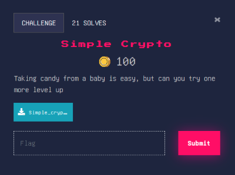
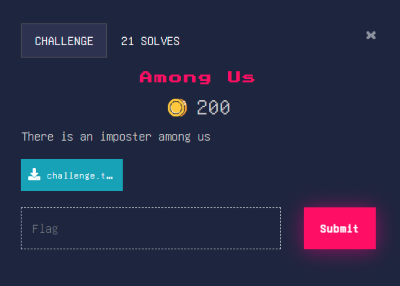
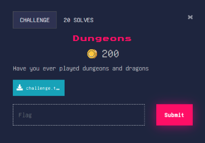

# Cryptography
## Challenge 1: Baby Crypto


Baby Crypto is a beginner-level cryptography challenge where a text file is provided containing an encoded string. The goal is to identify the encoding method used and decode it to retrieve the flag.

After opening the downloaded text file (Baby_crypto.txt), an encoded string was found: 
`VUNTSTI1e0IzYXNfNjRfaTVfSzFuZ30=`

The presence of **= padding** and the **character pattern** suggested that the string was encoded using **Base64**.

The Base64 string was decoded using **CyberChef**, producing: `UCSI25{B3as_64_i5_K1ng}`

---

## Challenge 2: Simple Crypto


Similar to Baby Crypto, Simple Crypto is a beginner cryptography challenge that builds on basic encoding knowledge. A text file is provided containing an encoded string, and the task is to decode it to reveal the flag.

After opening the downloaded file (Simple_crypto.txt), the following string was found:<br>
`5543534932357b4865785f49735f436f6f6c7d`

The string consists only of **hexadecimal characters (0–9, a–f)**, indicating that it is **Hex encoding**.

The hex string was decoded using **CyberChef**, resulting in: `UCSI25{Hex_Is_Cool}`

---

## Challenge 3: Among Us


### Challenge Description
We’re given a message encrypted with a **Hill cipher (2x2 matrix encryption mod 128)** using the key matrix:<br> 
`K = [[1, 1], [0, 1]]`
<br>Encrypted Pairs (as tuples):<br>
`(24, 67), (28, 73), (103, 53), (72, 77), (85, 116), (71, 95), (53, 114), (105, 112), (99, 111), (40, 73), (82, 95), (59, 117), (15, 33), (125, 0)`
<br>We need to find **K<sup>−1</sup> (mod 128)** and **decrypt all encrypted pairs** to recover the plaintext (flag).
### Methodology
1. Compute the determinant: `det(K) = 1⋅1 − 0⋅1 = 1`
2. Since `gcd(1, 128) = 1`, the matrix is invertible mod 128.
3. Find the inverse of KKK. For this triangular matrix, the inverse is straightforward:<br>
>K<sup>-1</sup> = [[1, -1], [0, 1]] (mod 128) = [[1, 127], [0, 1]]
4. Decrypt each ciphertext pair (c1,c2) into plaintext (p1,p2):<br>
>[p1, p2] = K<sup>-1</sup> [c1, c2] (mod 128) --> p1 = (c1-c2), p2 = c2
5. Convert the resulting numbers into ASCII characters.
### Solution
Decryption rule:
- p1 = (c1-c2) mod 128
- p2 = c2

Python snippet used:
```python
pairs = [
    (24,67),(28,73),(103,53),(72,77),(85,116),(71,95),
    (53,114),(105,112),(99,111),(40,73),(82,95),
    (59,117),(15,33),(125,0)
]

pt = []
for c1, c2 in pairs:
    pt += [(c1 - c2) % 128, c2]

flag = ''.join(chr(x) for x in pt if x != 0)
print(flag)
```
Run the python snippet in this website: https://www.onlinegdb.com/online_python_compiler 
<br>Flag obtained: `UCSI25{Math_Crypto_Is_Fun!}`
### Lessons Learned
- For small Hill cipher matrices, checking the determinant first quickly tells you if an inverse exists.
- Some keys (like this one) simplify decryption a lot: here it becomes basically “subtract the second value from the first.”
- Always watch for trailing null bytes (0) when converting to text.

---

## Challenge 4: Dungeons
 

Description given:
```
You've entered the Cryptic Dungeons! Deep within, you find an encrypted treasure chest.

The chest is protected by a mysterious cipher. Here's what you discovered:

Encrypted Message (hex):
574056413f2059732cfe8e1c0db54e471403a670b55270562d1dc6779e779b97bddf2678d7ae1e4c84a0

The encryption uses XOR with a key generated from a mathematical sequence.
The key is generated using a Fibonacci-like sequence where:
- The first term is the first prime number (2)
- The second term is the second prime number (3)
- Each subsequent term is the sum of the previous two terms (modulo 256)

The encryption process:
1. Generate a key sequence of the same length as the message
2. XOR each character of the message with the corresponding key value

Your quest: Decrypt the message to claim the treasure!
```
### Challenge Description
In this challenge, an encrypted treasure message is protected using an XOR cipher. The key for the XOR operation is generated from a Fibonacci-like sequence based on prime numbers. 

The encrypted message is provided in hexadecimal format:
`574056413f2059732cfe8e1c0db54e471403a670b55270562d1dc6779e779b97bddf2678d7ae1e4c84a0`

The goal is to reconstruct the key and decrypt the message to obtain the flag.
### Methodology
1. Convert the given hexadecimal string into raw bytes.
2. Generate the XOR key using a Fibonacci-like sequence:
   1. First term = 2 (first prime)
   2. Second term = 3 (second prime)
   3. Each subsequent term is the sum of the previous two terms (mod 256)
3. Ensure the key length matches the length of the encrypted message.
4. XOR each ciphertext byte with the corresponding key byte to recover the plaintext.
5. Convert the resulting byte values into readable ASCII characters.
### Solution
Python code used to decrypt the message:
```python
hex_str = "574056413f2059732cfe8e1c0db54e471403a670b55270562d1dc6779e779b97bddf2678d7ae1e4c84a0"
ct = bytes.fromhex(hex_str)

key = [2, 3]
while len(key) < len(ct):
    key.append((key[-1] + key[-2]) % 256)

pt = bytes(c ^ k for c, k in zip(ct, key))
print(pt.decode())
```
Run the python snippet in this website: https://www.onlinegdb.com/online_python_compiler 
<br>Flag obtained: `UCSI25{Dungeons_And_Dragons_Crypto_Quest!}`
