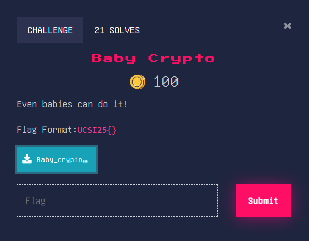

# Crytography
## Challenge 1: Baby Crypto

Baby Crypto is a beginner-level cryptography challenge where a text file is provided containing an encoded string. The goal is to identify the encoding method used and decode it to retrieve the flag.
After opening the downloaded text file (Baby_crypto.txt), an encoded string was found:
VUNTSTI1e0IzYXNfNjRfaTVfSzFuZ30=
The presence of = padding and the character pattern suggested that the string was encoded using Base64. 
The Base64 string was decoded using CyberChef, producing:
UCSI25{B3as_64_i5_K1ng}

---

